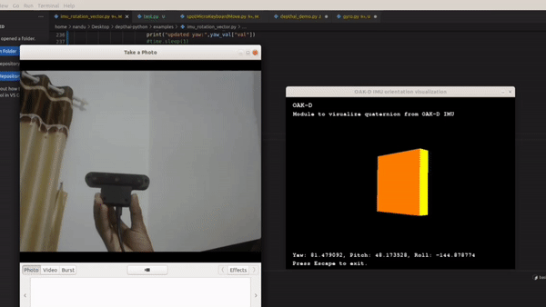

# AI-Quadruped-Robot-For-Agriculture




# Software Installation - Agribot V1.0
We followed the GitHub repo by Mike4192 for this version. Go to this [link](https://github.com/mike4192/spotMicro) to learn more.
After installing ROS melodic on Nvidia Jetson Nano, run,
```sh
git clone https://github.com/kishorkuttan/AI-Quadruped-Robot-For-Agriculture.git
source /opt/ros/kinetic/setup.bash 
mkdir -p ~/catkin_temp  
cp -a /path/to/src/from AI-Quadruped-Robot-For-Agriculture/ ~/catkin_temp/
catkin build
source devel/setup.bash
```
If you find errors during catkin build install necessary libraries or directly copy the libraries to **/src/** folder and re run catkin_build
# 3D prints
Go to this [link](https://www.thingiverse.com/thing:3445283) for spot micro 3D print files.

# Connection


